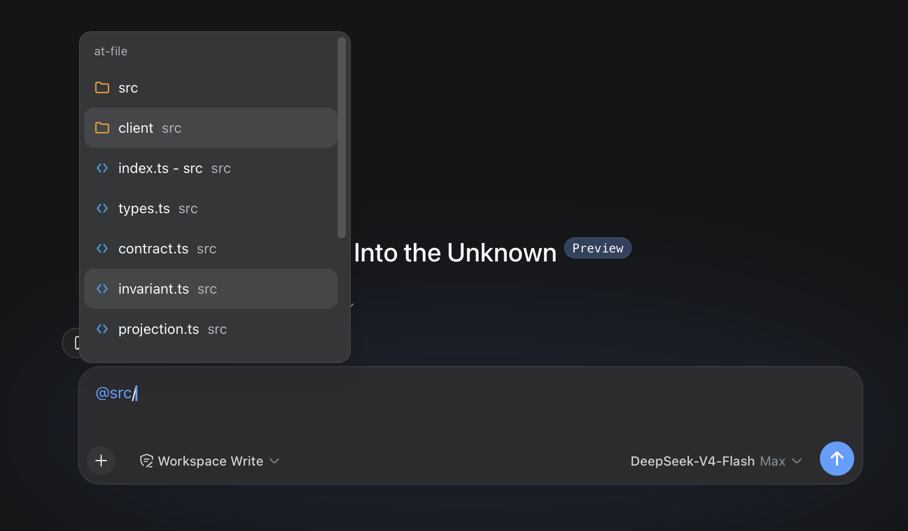

> **来源与许可**：基于 [omdsh-dev/dsh-at-file](https://github.com/omdsh-dev/dsh-at-file) v0.6.0（MIT）开发，本地按 Registry verified commit 接入。详见仓库根目录 [README.md](../README.md) 的来源与许可总表。

**本地改动（Local modifications）**：
- 按 Registry verified 固定 commit `9c71e52`（v0.6.0）接入，源码未改
- Web/Desktop 双端以 link 依赖 + 手工 patch 实例注册
# dsh-at-file

## 项目简介

dsh-at-file 是面向 DeepSeek Harness Web 界面的工作区路径引用插件。在输入框输入 `@` 即可搜索当前工作区中的文件与目录，并将选定的相对路径作为本轮引用。插件不读取文件字节、不递归展开目录、不自动向模型注入内容；任务需要读取时，由当前会话中可用的工具（如 `read`、`read_image`）处理该路径。



## 功能特性

- **`@` 路径选择器**：普通关键词匹配文件名；关键词含 `/` 时按路径片段依次匹配，例如 `src/view` 可命中 `src/client/view.ts`，`src/` 可搜索该目录下的条目。
- **目录导航**：高亮目录候选后按右方向键进入，输入内容推进至 `@path/`（末尾不添加空格）并保持候选菜单继续显示；按回车或鼠标选择则完成该目录引用。
- **结果展示**：候选项文件名在前、父目录在下；重名文件在主标题中附带父目录；内置 SVG 图标区分目录、源代码、文本、PDF、图片、数据与配置、压缩包及其他文件。
- **默认索引过滤**：跳过常见版本控制目录、IDE 元数据、依赖目录、缓存与构建产物（覆盖 VS Code、Visual Studio、JetBrains IDE、Fleet、Eclipse、Android 与 Gradle、Xcode、CMake、Flutter、.NET、Unity、Unreal，以及常见 JavaScript 与 Python 输出目录），并默认排除 `desktop.ini`、`Thumbs.db`、`.DS_Store` 等系统元数据文件。
- **文件提及过滤**：在设置页按全局/工作区分级管理文件名过滤规则，支持 Exact 与 Regex 两种匹配模式及独立的大小写开关。

## 使用说明

从 `@` 菜单选择结果后，路径保留在输入内容中，输入框上方的引用栏可打开路径或移除引用：

```text
请检查 @docs/spec.pdf
```

每次 agent 开始处理前，插件会确认该路径位于当前工作区且仍然存在，随后补充一条简短的引用消息：

```xml
<workspace-reference path="docs/spec.pdf" kind="file" />
```

引用消息仅包含工作区相对路径与路径类型（`file` 或 `directory`）。文件格式与文件大小不改变处理流程，PDF 与其他工作区文件使用相同的路径引用机制。该机制适用于 `0.3.0` 及后续版本；早期版本会在提交时读取文件内容，并受文件大小限制。

路径处理规则：

- 选择器索引当前工作区中的常规文件与目录，并跳过已配置的目录名与符号链接。
- Host 遍历工作区时合并全局与当前工作区的文件名过滤规则；被过滤的条目不占用 `maxIndexedFiles`，也不会发送至浏览器。
- Host 仅接受工作区相对路径；绝对路径以及越出工作区的路径会被忽略。
- 引用标记仅由用户输入的文本生成；点击引用路径时调用 Harness 的 `host.openPath` 端点。
- 每个会话的路径索引缓存 30 秒。
- `@path` 标记不能包含空白字符或另一个 `@` 字符。
- `maxIndexedFiles` 限制选择器显示的结果数量；手动输入且确实存在于工作区内的路径仍可引用。

## 安装与接入

官方命令（Web profile）：

```sh
dsh plugin --profile web add https://github.com/omdsh-dev/dsh-at-file/archive/refs/tags/v0.6.0.tar.gz
```

更新现有安装使用同一命令；安装完成后重启 `dsh web`，确保 Host 与浏览器客户端加载 `0.6.0`。

本机接入方式（Web/Desktop 双端）：

- 入口：`lib/index.js`（Host：索引工作区路径、校验 `@path`、在 agent/pre-step 注入仅含相对路径及 file/directory 类型的引用标记）、`lib/client.js`（浏览器客户端：输入触发器、目录导航、引用栏与「工作区文件提及」设置页）。
- 双端 profile 以 `link:` 依赖指向本插件目录，并在各自 `cordis.patch.yml` 登记唯一的 `dsh-at-file` insert。
- 唯一运行时依赖为 `zod`；固定提交包含运行产物且无生命周期脚本，未执行 build/prepare。
- 不写入 `dsh.profile.bundles`，避免与手工 insert 双加载。

## 配置

以下配置仅影响路径选择器索引，请写入所选 profile 的 `cordis.patch.yml`（常用路径 `~/.dsh/profiles/web/cordis.patch.yml`）：

```yaml
- id: dsh-at-file
  config:
    maxIndexedFiles: 10000
```

- `maxIndexedFiles`：工作区索引条目的数量上限。
- `ignoreDirs`：替换内置忽略目录列表；设为 `[]` 时索引所有目录；省略时沿用内置列表。

## 开发

```sh
pnpm install
pnpm run check
pnpm run test
pnpm run build
```

开发环境默认 Harness 仓库位于 `../dsh`。`lib/` 下的构建产物随仓库提交，profile 安装过程无需执行包构建脚本。

## 许可

MIT
