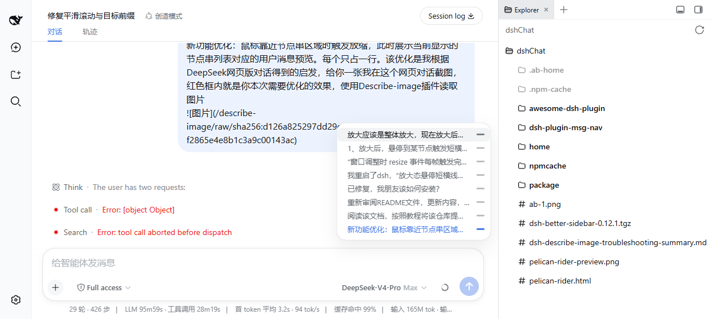

[**English**](./README.en.md) | [简体中文](./README.md)

[](https://awesome-dsh-plugin.com)

# dsh-plugin-msg-nav

DeepSeek Harness conversation node navigation rail plugin: renders a column of short dash nodes on the right edge of the conversation area — one node per **real user message** — tracking your reading position. When the mouse approaches the node strip, it "morphs open" into a single-line message preview panel (covering the strip's original position; moving away restores it). Clicking any preview smoothly jumps to that message and highlights the dash; when there are too many nodes, scroll the wheel inside the hover area to browse the list. The host-side session projection makes the strip cover **all** user messages across the entire history the moment you enter a session — zero page-fetch requests, no initial lag.



Distributed as a **bundle**: after `dsh plugin` install, it automatically joins the profile layer stack — no manual config edits. Architecture follows dsh-chat-timeline's host session projection + client on-demand loading pattern.

## Installation (official DSH command)

```bash
# Install directly from GitHub
dsh plugin --profile web add github:SherUnlocked-4869/dsh-plugin-msg-nav
```

`dsh plugin` forwards to pnpm to install into the profile directory and automatically adds packages declaring `dsh.bundle` to the `dsh.profile.bundles` layer stack. Then start (or restart, if already running) the deployment:

```bash
dsh web          # or dsh --profile <your profile>
```

Update to the latest version:

```bash
cd ~/.dsh/profiles/web && pnpm update dsh-plugin-msg-nav
```

Uninstall:

```bash
dsh plugin --profile web remove dsh-plugin-msg-nav
```

## Features

| Feature | Behavior |
| --- | --- |
| Node navigation rail | Vertical column of short dash lines on the right edge of the conversation area, one node per **real user message** (system-injected goal auto-continuations etc. are not counted), constant 20px spacing |
| Hover popup panel | Mouse enters the node strip area: the dashes fade out and a **single-line preview panel pops out to the left** (0.18s scale animation, covering the strip's original position; in-row dashes land exactly on the x-coordinates of the original nodes, as if the strip morphs open); moving out restores the strip |
| Panel layout | One line per message (text left + dash right), 24px line height, symmetric 8px vertical padding; hovering a line highlights its text and dash **synchronously** with an 8px rounded background; the current reading-position line (text + dash) is highlighted in brand blue/white |
| List scrolling | Shows at most 10 items; when exceeded, hovering in the node strip area and scrolling the wheel scrolls the list (the page itself does not scroll), and the panel scrolls proportionally |
| Exit re-center | After the mouse leaves the hover area, the list smoothly re-centers on the current reading position and resumes tracking |
| Reading-position tracking | The active node (brand blue / white in dark mode) updates in real time with scroll detection |
| Click to jump | Smooth-scrolls to the corresponding message + full-width brand-blue highlight dash (1.5s fade-out); a watchdog fallback guarantees landing even under streaming-output interference, and the list auto-centers on the target node |
| Full history instantly in strip | Host-side session projection (`msgNavMessages`) folds the entire log; the full user message list arrives instantly via the history tail page + push frames — zero page-fetch requests on entering a session, the strip immediately covers **all** user messages with no initial lag. Deployments without the projection registry mounted automatically fall back to background page-by-page loading (50 per page, up to 120 pages), with a pulsing dash at the strip's end while loading |
| Click on-demand loading | When clicking an old message node not yet rendered into the window, older history is fetched page by page until the message enters the window and its row renders, then smooth jump + highlight (precisely associated by message id and window row, independent of node key format) |
| Auto-hide | Hidden when there are <2 user messages, the session is empty, or the view is not a conversation (e.g. the trace page) |
| Rendering details | Node positions are aligned to device pixels by devicePixelRatio (consistent thickness); window resizes are rAF-coalesced so the UI never lags |

## How it works

The same "projection fast path + on-demand paging" pattern as dsh-chat-timeline:

1. **Host projection**: the host half registers the `msgNavMessages` session projection unit, folding every `user/message` event in the entire log (only real user messages and steering with `source.kind === "user"`; injected context lines are excluded — exactly matching the chat view node assembler's classification) into a full `{seq, time, text, id}` list; the framework keeps driving it, delivered via the history tail page and `session/projection` push frames.
2. **Client instant rendering**: the node strip renders the full list directly with `useProjection("msgNavMessages")`; messages within the loaded window are associated with DOM rows by persistent id for reading-position tracking and jumps.
3. **Click on-demand paging**: when an old node not yet in the window is clicked, `loadOlder()` is looped by message id (50 per page, up to 120 pages) until the target enters the window and renders its row, then smooth jump + highlight.
4. **Fallback**: on deployments without the projection registry mounted, the client automatically falls back to a background `loadOlder` full loop (stopping immediately once the projection arrives); session switches invalidate the old loop generationally, and plugin unload stops it too.

## Reference project

The new "full history instantly in strip" and "click on-demand loading" features reference **[jjxjjjjiik-bot/dsh-chat-timeline](https://github.com/jjxjjjjiik-bot/dsh-chat-timeline)** (MIT):

- **Host session projection** (`msgNavMessages`) follows its `dshChatTimeline` projection unit's folding approach: fold the entire log into a full user message list on the host side (only real user messages and steering with `source.kind === "user"`, injected context excluded) and deliver it instantly to the client via the history tail page and push frames, avoiding the initial lag of client-side page-by-page history pulls;
- **Client on-demand `loadOlder`** (fetching page by page until the target enters the window when clicking old nodes) follows its `jumpToMessage` load-wait-land pattern; this plugin instead associates by persistent message id and window row, without relying on its hard-coded node key format;
- The background page-by-page fallback for deployments without the projection likewise follows its client `loadOlder` loop (50 per page, up to 120 pages).

## Package structure

- `lib/client.js` — browser-side bundle (`window.__ModuleLoader__` registration format, loaded/unloaded with the DSH module system); node strip UI + projection instant rendering + fallback background loading + click on-demand loading
- `lib/index.js` — host-side session projection unit `msgNavMessages` (full user message folding; automatically inactive when the registry is absent)
- `lib/types/` — TypeScript type declarations
- `cordis.patch.yml` — bundle patch layer: `insert` one `ui-msg-nav` client line
- `package.json` — dual declarations of `dsh.client` (browser manifest) + `dsh.bundle` (bundle manifest)
- `assets/screenshot.png` — screenshot

## FAQ

**`dsh plugin add` reports `ERR_PNPM_TARBALL_INTEGRITY`?**

If a third-party plugin installed in the profile via a `refs/heads/...` branch address is updated upstream, the new tarball checksum no longer matches the lockfile, and pnpm's supply-chain protection rejects the entire install. After confirming the upstream update is trustworthy, pin that dependency to a specific commit instead (this plugin is installed that way):

```json
"dependencies": {
  "<pkg>": "https://codeload.github.com/<owner>/<repo>/tar.gz/<commit-sha>"
}
```

Then run `pnpm install` to refresh the lockfile, and re-run `dsh plugin add`.

**The node strip doesn't appear?**

- Confirm the deployment has been restarted and the page refreshed (bundle changes require a deployment restart; refreshing the page usually fetches the new bundle)
- The current session needs ≥2 real user messages and must be in the "conversation" view

## Development

```bash
git clone https://github.com/SherUnlocked-4869/dsh-plugin-msg-nav.git
# local integration: install into a test profile
dsh plugin --profile <profile> add file:<abs-path>
dsh --profile <profile> --port 3090
```

## License

MIT
